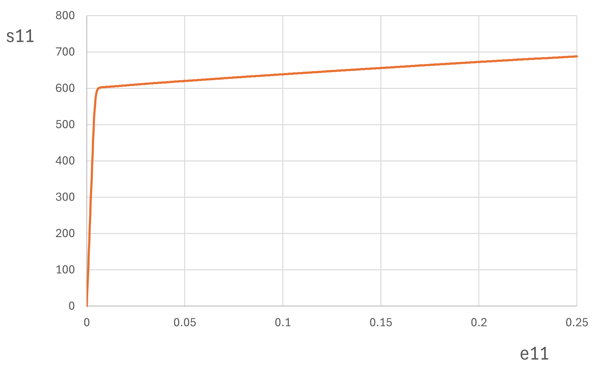

# CPFEH

Crystal Plasticity Finite Element Homogenization model for
[Dyalog APL](https://www.dyalog.com/)

## Example

The script [`eg.apls`](eg.apls) runs several example simulations using
a randomly generated microstructure with Fe-gamma and Fe-alpha grains applying
boundary conditions of uniaxial tension.

Expected output:

        grains      steps       ∆time       iter        seconds
            50         100   2.50E¯1          4698        8.55
           100         100   2.50E¯1          6692       19.80
           250         100   2.50E¯1          4279       40.14
           500         100   2.50E¯1          3669      103.94
            50         250   2.50E¯1          9751       20.64
            50         500   2.50E¯1         15398       33.62
          1000        1000   2.50E¯1         18893     1997.54   r.csv  tex.csv  f.csv

Timings (in the last column) may vary. Plotting the strain and stress
in the generated file `r.csv` should result in the following tensile
diagram:

## CPFEH Model

The model uses a gradient descent method to solve the self-consistent
polycrystal formalism. Grain interaction is determined such that each
grain is in a relaxed-constraints relationship with respect to its
direction dependent environment.

### Grain Behaviour

Each grain is assumed to have elasto-viscoplastic behaviour. Plastic
strain is determined using the strain rate sensitivity approach.

#### Slip Systems

Plastic strain happens by shear along crystallographic directions
on crystallographic planes. Each slip system is thus defined by
a direction (Burges vector), and the normal to the plane.

#### Strain Hardening

Accumulated shear causes the increment of the resolved shear stress
according to the Voce law.

### Grain-Environment Interaction

The environment of each grain along each direction is determined
depending on the distribution measured experimentally. It is assumed
that the neighbour grains will have relaxed the components not
associated with the common face.

### Self-Consistent Formalism

Localisation tensors allow to correlate macrospic and grain stresses.
These magnitudes are also related according to the interaction equation.
Using an iterative method, a solution is found that satisfies all
these conditions.

### Microstructural Update

After a solution has been found for each simulation step, the
microstructure of the material is updated. The strain hardening law
is used to increase the resolved shear stress, grains are rotated
depending on plastic deformation and angular velocity, and deformation
tensors are modified.

## Input and Output

The `CPFEH` dyadic operator takes as right operand convergence parameters
and as left operand the target error and maximum number of steps. As right
argument it takes the microstructure, including materials (which can be
read from json files with the `MATERIAL` function), orientations,
topology (given as common areas in each direction) and volume. It returns
a table with results by time (strain, stress and number of iterations to
solve stress and to reach self-consistency), the deformed texture, and the
deformation of each grain.

See [example](eg.apls).

### Experimental microstructures

The `MICRO` function is provided to process experimental data. It can generate
the input needed by `CPFEH` either from EBSD `.ang` files or from (discrete)
distributions of crystallographic orientations and disorientation angles on
different planes.

Usage:

    p e x y      ← aci MICRO  f[crop]          ⍝ grid and cell size from ang file
    p e v[q m n] ← [d] MICRO  a c i f[crop]    ⍝ volumes and disorientations from ang
    p e v[q m n] ← [d] MICRO  p e s            ⍝ volumes and disorientations from ang
    p e v x y z  ←  d  MICRO  p e v q m[n o]   ⍝ CPFEH parameters from distributions
    p e v        ← [v] MICRO,⊂p e v            ⍝ merge volumes
    q m          ← [v] MICRO,⊂q m              ⍝ merge disorientations
    d            ←  d  MICRO  e                ⍝ disorientations namespace

Parameters:

- `f[crop]` EBSD ang file and optional crop region (four additional `x0 y0 x1 y1` parameters)
- `a c i` angle increment (zero to not round) and minimum image quality and confidence index
- `d` disorientation increment or disorientation namespace
- `p e v` phases, euler angles and volumes
- `q m n z` pairs of phases and istributions of disorientations in x y z directions

## References

- [A self-consistent anisotropic approach for the simulation of plastic
deformation and texture development of polycrystals: application to zirconium alloys][1].
RA Lebensohn, CN Tomé. Acta metallurgica et materialia, 1993

- [Material modeling with the visco-plastic self-consistent (VPSC) approach: theory
and practical applications][2]. CN Tome, RA Lebensohn. 2023

- [An improved algorithm for the polycrystal viscoplastic self-consistent model and
its integration with implicit finite element schemes][3]. J Galán, P Verleysen, RA Lebensohn.
Modelling and Simulation in Materials Science and Engineering, 2014

- [A multivariate grain size and orientation distribution function: derivation from
electron backscatter diffraction data and applications][4]. J Galán López, LAI Kestens.
Applied Crystallography. 2021

[1]: https://www.sciencedirect.com/science/article/abs/pii/095671519390130K
[2]: https://www.sciencedirect.com/book/9780128207130/material-modeling-with-the-visco-plastic-self-consistent-vpsc-approach
[3]: https://iopscience.iop.org/article/10.1088/0965-0393/22/5/055023/meta
[4]: https://journals.iucr.org/paper?S1600576720014909